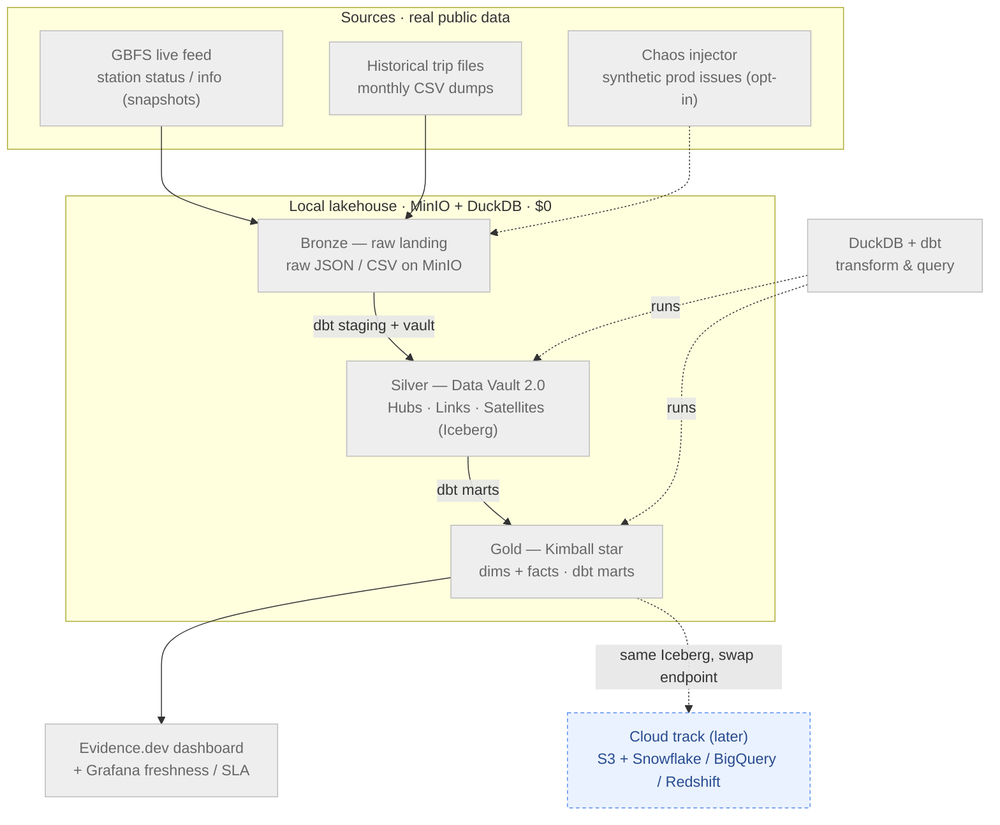

# bikeshare-lakehouse

[](https://github.com/datasuccess/bikeshare-lakehouse/actions/workflows/ci.yml)
[](LICENSE)


A **local-first, open-lakehouse** data platform for public **bike-share** data, modelled with
**Data Vault 2.0 → Kimball**. It runs **entirely on a laptop at $0** — then the *same code* promotes
to the cloud by swapping one endpoint.

> **One-line pitch:** Ingest real bike-share data (**GBFS** live feed + historical **trip** files) →
> land it as **Apache Iceberg** on **MinIO** (a local S3) → integrate it as a **Data Vault 2.0** →
> serve it as a **Kimball star schema** → transform with **dbt**, query with **DuckDB**, orchestrate
> with **Airflow 3**, validate with **Soda**, monitor with **Grafana**, and show it in an
> **Evidence.dev** dashboard. All in Docker, all local, all free.

---

## 🚦 Status

> **Phase 0 — repository scaffolding.** This is the plan + structure. **No pipeline code yet.**
> Everything below describes what each part *will* do; each file states its own purpose. Build
> begins one phase at a time (see [`docs/04-roadmap.md`](docs/04-roadmap.md)), **local-first**.

## Two tracks, one codebase

The whole design rests on one idea: **MinIO speaks the S3 API and Iceberg is a portable table
format**, so local and cloud are the *same pipeline* with a different endpoint.

| | **Local track** (now) | **Cloud track** (opt-in, later) |
|---|---|---|
| Object store | **MinIO** (local S3) | **AWS S3** |
| Query engine | **DuckDB** | **Snowflake / BigQuery / Redshift** (read the same Iceberg) |
| Cost | **$0** | trial/free-tier + `terraform destroy` |
| What changes | — | `AWS_ENDPOINT_URL` + `dbt --target`. That's it. |

We build and prove **the entire platform locally first.** Cloud lives in [`cloud/`](cloud/) as an
opt-in overlay — added only once the local pipeline runs end-to-end. It is intentionally empty today.

## Architecture (local-first)



*Rendered diagrams (hero, medallion, DAG, star schema, lineage) will live in
[`docs/diagrams/`](docs/diagrams/).*

## Why bike-share + Data Vault 2.0?

Bike-share is a near-perfect fit for DV2.0: stable **business keys** (station IDs), **slowly-changing**
descriptive attributes (station name/capacity), and a **high-frequency status feed** the API only
serves as *"now"* — so the pipeline's job is to **capture snapshots into satellites and build the
history the source never keeps.** Full model in [`docs/03-data-model.md`](docs/03-data-model.md).

## Repository layout

```
bikeshare-lakehouse/
├── README.md              ← you are here
├── docs/                  the plan: overview, architecture, ADRs, data model, roadmap, cost, case study
│   └── diagrams/          rendered SVG/PNG diagrams (embedded above)
├── ingestion/            GBFS + trip-file loaders (real-API resilience patterns)
├── dbt/                  ONE dbt project: staging → Data Vault 2.0 → Kimball marts
├── orchestration/        Airflow 3 DAGs (cadence-based: daily feed / monthly trips)
├── quality/              Soda + dbt data-quality checks
├── monitoring/           Grafana panels + failure alerts (freshness / SLA)
├── chaos/                synthetic prod-issue injector (schema drift, dupes, late data)
├── showcase/             Evidence.dev dashboard (the money-shot) + screenshots
├── cloud/                OPT-IN overlay (later): Terraform + Snowflake/BigQuery/Redshift
└── infra/                local Docker stack (MinIO, Postgres metadata, Airflow, Iceberg catalog)
```

## Roadmap (build order)

Local-first: **Phases 0–8 are $0 local**; **Phase 9** is the opt-in cloud promotion. Full detail with
per-phase purpose in [`docs/04-roadmap.md`](docs/04-roadmap.md).

`0 Foundations → 1 Ingestion → 2 Lakehouse landing → 3 Data Vault → 4 Kimball marts → 5 Data quality
→ 6 Orchestration → 7 Showcase/BI → 8 Monitoring + chaos → 9 Cloud (opt-in)`

## Quickstart

> _Coming with Phase 0's build. It will be: `make up` (start the local stack) → `make run` (ingest →
> vault → marts) → open the dashboard. 100% local, no cloud account, synthetic-safe._

## Design decisions

Every real choice is recorded as an ADR in [`docs/02-decisions.md`](docs/02-decisions.md) — including
the load-bearing one: **build the Data Vault once, serve Kimball to all three warehouses** (never
three divergent vaults).

## License

[MIT](LICENSE) · public bike-share data used under each system's open-data license · no PII.
